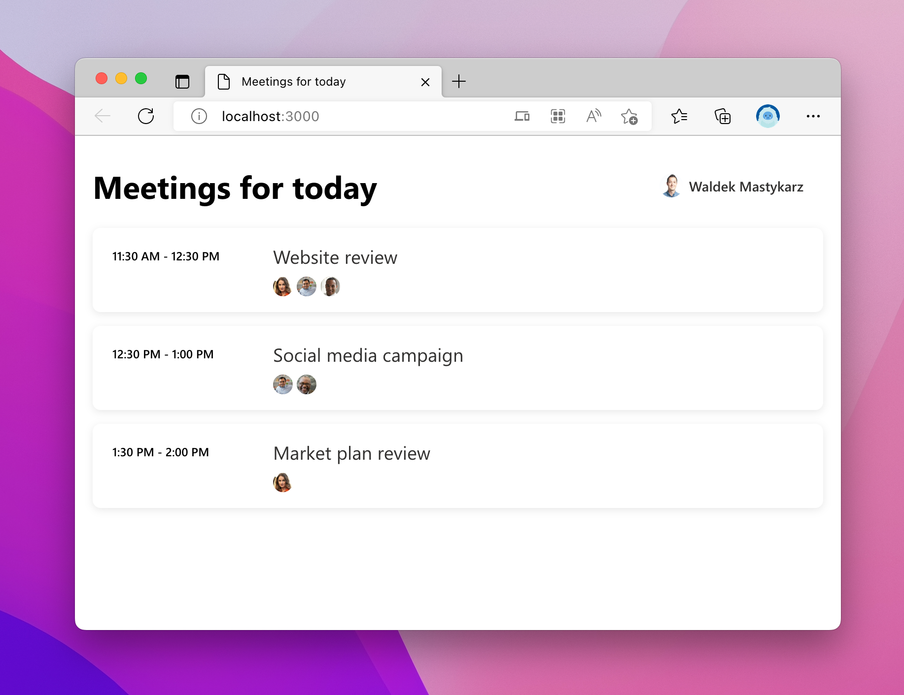

# Sample single page application showing upcoming meetings for a Microsoft 365 user

This repo contains a sample single page application (SPA) that shows how to use the Microsoft Graph Toolkit to get upcoming meetings of the current user from Microsoft 365.

## Prerequisites

- [Node.js LTS](https://nodejs.org)
- Microsoft 365 developer tenant, you can get it for free through the [Microsoft 365 developer program](https://developer.microsoft.com/microsoft-365/dev-program?WT.mc_id=m365-79469-wmastyka)

## Minimal path to awesome

1. Clone the repo
1. Change the working directory to the repo folder
1. Start terminal, change the working directory to the repo folder and run: `chmod +x setup.sh`
1. Run the setup script: `./setup.sh`
1. Start the development server: `npx lite-server`
1. In your web browser open `http://localhost:3000/index.html`

## Concepts introduced in this sample

- Retrieving upcoming meetings for today from the Microsoft 365 calendar using the [Microsoft Graph Toolkit's](https://learn.microsoft.com/graph/toolkit/overview?WT.mc_id=m365-79469-wmastyka) [Agenda](https://learn.microsoft.com/graph/toolkit/components/agenda?WT.mc_id=m365-79469-wmastyka) component
- Allowing users to sign in to the application using their Microsoft 365 account with the [Microsoft Graph Toolkit's](https://learn.microsoft.com/graph/toolkit/overview?WT.mc_id=m365-79469-wmastyka) [Login](https://learn.microsoft.com/graph/toolkit/components/login?WT.mc_id=m365-79469-wmastyka) component
- Programmatically initializing the [MSAL2 auth provider](https://learn.microsoft.com/graph/toolkit/providers/msal2?WT.mc_id=m365-79469-wmastyka) from Microsoft Graph Toolkit
- Initializing Microsoft Graph Toolkit authentication provider with [predefined scopes](https://learn.microsoft.com/graph/toolkit/providers/providers?WT.mc_id=m365-79469-wmastyka#permission-scopes)
- [Using custom templates](https://learn.microsoft.com/graph/toolkit/customize-components/templates?WT.mc_id=m365-79469-wmastyka) with Microsoft Graph Toolkit components
- [Conditionally rendering content](https://learn.microsoft.com/graph/toolkit/customize-components/templates?WT.mc_id=m365-79469-wmastyka#conditional-rendering) in Microsoft Graph Toolkit's components' templates
- Registering a new Azure AD application for a single page app using [CLI for Microsoft 365](https://aka.ms/cli-m365)
